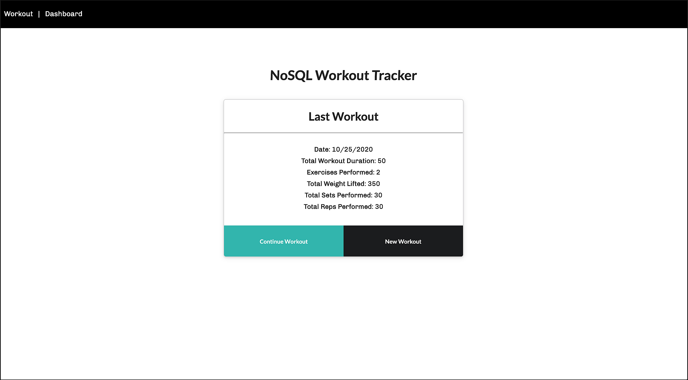
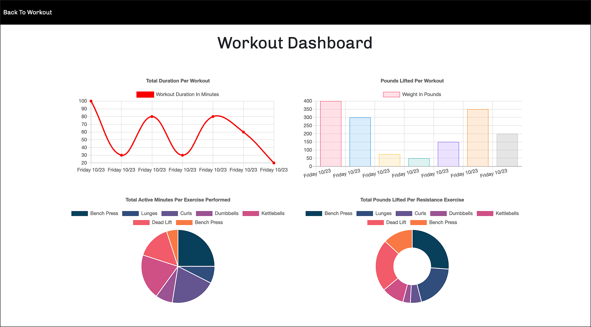

# NoSQL Workout Tracker
‎
‎‎ 

 

      
  

  ---
  
  
&nbsp;

    

## Description 

&nbsp;

<strong><em>What is this project? Why did you make this project? How did you make this project?</strong></em>

&nbsp;

NoSQL Workout Tracker is a full stack application that allows users to input specifics about their recent workouts and the exercises that they performed during them. Exercises are categorized by resistance training and cardio, and the exact name of the exercise is defined by the user themselves. There are input fields for time duration of each exercise, distance, weight lifted, sets, and reps. Workout information is stored in a `MongoDB` database, and totals are calculated from each workout. The most recent workout totals are presented on the main page, and the last seven days are visually represented within the dashboard section thanks to `Chart.js`. This is useful for those who want to keep track of details surrounding their most recent workouts and view their progress over the course of the last seven sessions.

&nbsp;

View the application here =>‏‏‎ ‎‏‏‎ ‎‏‏‎ ‎‏‏[`NoSQL Workout Tracker`](https://nosql-work-out.herokuapp.com/)

&nbsp;

---

&nbsp;

## Table of Contents: 

&nbsp;

* [Usage](#usage)
* [License](#license)
* [Credits](#credits)
* [Questions](#questions)

&nbsp;

---

&nbsp;

## Usage

&nbsp;

<strong><em>Instructions and examples for usage + development details:</strong></em>

&nbsp;

Log on to:‏‏‎ ‎‏‏‎ ‎‎‏‏[`NoSQL Workout Tracker`](https://nosql-work-out.herokuapp.com/).‏‏‎ ‎ When you first arrive you'll be greeted with the most recent workout details. If you haven't entered any workouts yet, you'll be asked ot start a new workout. If you've already entered one previously, you can choose to continue your workout, or begin a new one. Either way, you'll then be asked to enter details about a resistance based exercise, or cardio. For resistance workouts: you'll add the name of the exercise, the time duration of the exercise in minutes, the weight that you lifted in pounds, the amount of sets lifted, and the reps within each set. You can then add this workout if only one exercise was performed, or on the bottom right tab you can add an additional exercise. For cardio: very similar, but you'll input distance in miles (if applicable), duration of the cardio exercise in minutes, and the name of the exercise performed. When totally finished adding all exercises within a workout routine, you can add the workout by hitting the submit tab on the bottom left. You'll then be immediately re-directed to the main page and presented with the totals of the workout you just logged. You can view infographic information on the dashboard that will give workout duration totals on a line chart, weight lifted totals on a bar chart, and breakdown percentages of how much of the workout was spent on each workout via pie/doughnut charts below.

&nbsp;

&nbsp;

<!-- ---

&nbsp;

View a video overview on usage here:

 

&nbsp;
 -->

---

&nbsp;

 

&nbsp;

---

&nbsp;

 

&nbsp;

---

<!-- 
&nbsp;

 

&nbsp;

 -->

<!-- ---

&nbsp;

 

&nbsp;

---

&nbsp;

 

&nbsp;

---

&nbsp;

 

&nbsp;

---

&nbsp;

&nbsp;
  -->
<!-- 

--- -->

&nbsp;

## License

&nbsp;

This project is covered under the MIT license. 

&nbsp;

---

&nbsp;

## Credits

&nbsp;

<strong><em>Third party assets:</strong></em>

&nbsp;

`Node.js` =>‏‏‎ ‎ ‏‏‎ ‎[An asynchronous event-driven runtime built on Chrome's V8 JavaScript engine.](https://nodejs.org/en/)

&nbsp;‏‏‎‏‏‎ ‎<strong>+</strong>

`Express.js` =>‏‏‎ ‎ ‏‏‎ ‎[A fast, unopinionated, minimalist web framework for Node.js.](https://expressjs.com/)

&nbsp;‏‏‎‏‏‎ ‎<strong>+</strong>

`MongoDB` =>‏‏‎ ‎ ‏‏‎ ‎[The most popular databse for modern apps.](https://www.mongodb.com/)

&nbsp;‏‏‎‏‏‎ ‎<strong>+</strong>

`Mongoose npm` =>‏‏‎ ‎ ‏‏‎ ‎[A MongoDB object modeling tool designed to work in an asynchronous environment. ](https://www.npmjs.com/package/mongoose)

&nbsp;‏‏‎‏‏‎ ‎<strong>+</strong>

`Chart.js` =>‏‏‎ ‎ ‏‏‎ ‎[Simple yet flexible JavaScript charting for designers & developers.](https://www.npmjs.com/package/chart.js/v/2.8.0)

&nbsp;‏‏‎‏‏‎ ‎<strong>+</strong>

`Semantic Ui` =>‏‏‎ ‎ ‏‏‎ ‎[Semantic empowers designers and developers by creating a shared vocabulary for UI.](https://semantic-ui.com/)

&nbsp;‏‏‎‏‏‎ ‎<strong>+</strong>

`Heroku` =>‏‏‎ ‎ ‏‏‎ ‎[A platform that enables developers to build, run, & operate applications entirely in the cloud.](https://www.heroku.com)

&nbsp;‏‏‎‏‏‎ ‎<strong>+</strong>

`Morgan npm` =>‏‏‎ ‎ ‏‏‎ ‎[HTTP request logger middleware for node.js that is named after Dexter.](https://www.npmjs.com/package/morgan)

&nbsp;

---

&nbsp;

## Questions?

&nbsp;

Shoot me an e-mail! => jonathan@jonathanschimpf.com

&nbsp;

Check out more of my work here on =>
[GitHub](http://github.com/jonathanschimpf)

&nbsp;

